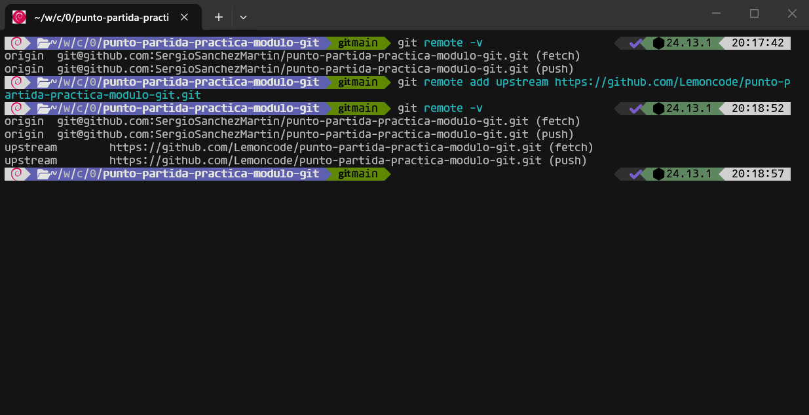
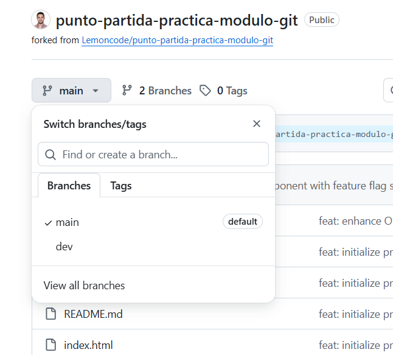
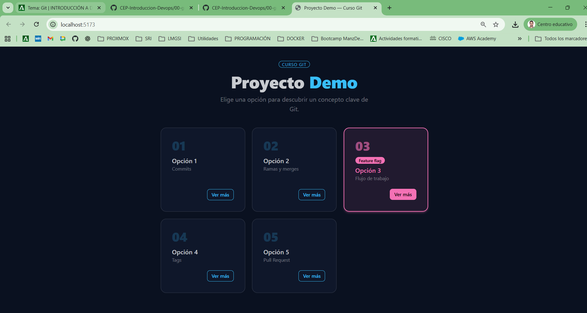
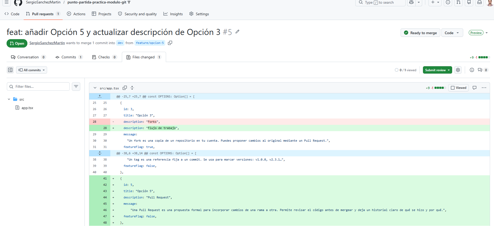
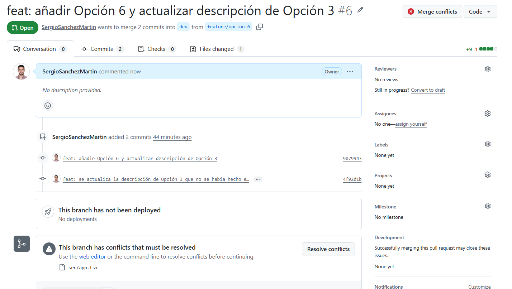
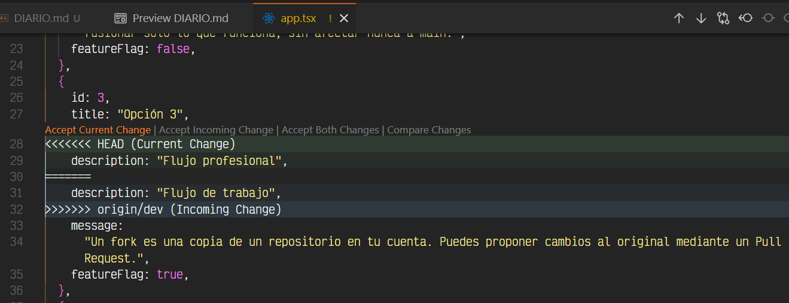
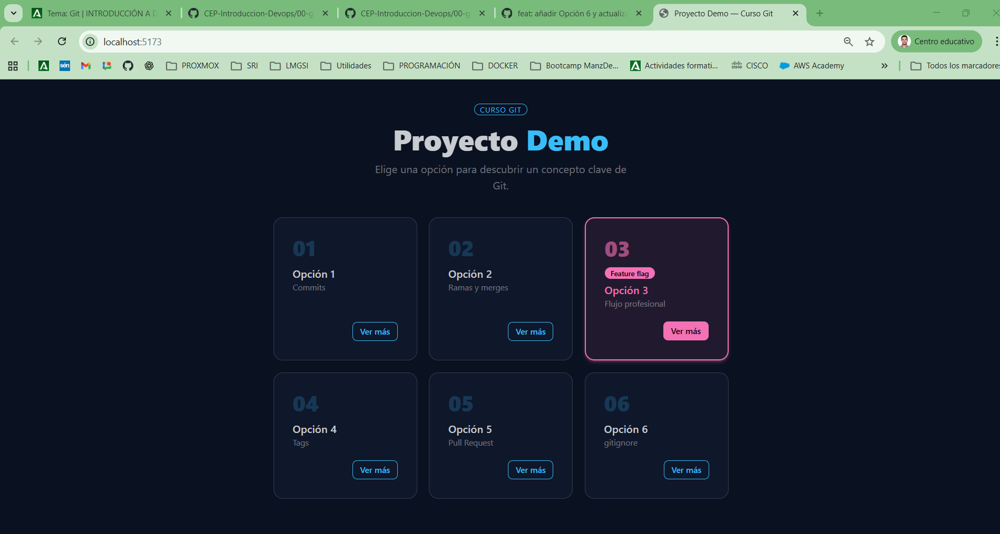
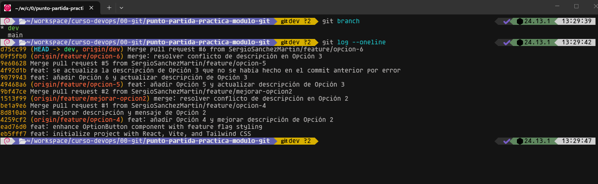
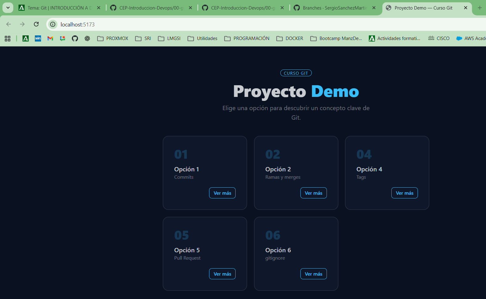
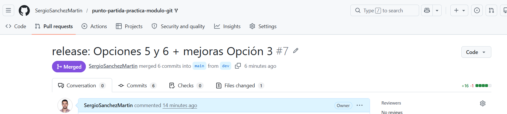

# Laboratorio — Flujo Git colaborativo
## Descripción
Este laboratorio es la prueba de evaluación del módulo de Git. Vas a reproducir, de forma autónoma, el mismo flujo de trabajo profesional que viste en clase: fork, ramas, commits, Pull Requests y resolución de conflictos.

No hay nadie que te guíe paso a paso. Tienes los apuntes de clase, los comandos vistos y tu criterio. Eso es exactamente lo que ocurre en un equipo de desarrollo real.

## Capturas obligatorias
| # | Qué debe mostrar la captura |
| :---: | :--- |
| 1 | Terminal con `git remote -v` mostrando `origin` y `upstream` |
| 2 | GitHub con la rama `dev` visible en el desplegable de ramas |
| 3 | La app en el navegador con la Opción 5 recién añadida |
| 4 | El PR de Feature A en GitHub con la pestaña **Files changed** abierta |
| 5 | El PR de Feature B en GitHub mostrando el banner rojo de conflicto |
| 6 | Los marcadores de conflicto (`<<<<<<<`, `=======`, `>>>>>>>`) en VS Code |
| 7 | La app en el navegador con todas las opciones visibles tras resolver el conflicto |
| 8 | Terminal con `git log --oneline` en `main` mostrando todos los commits |

## Tareas obligatorias
### Tarea 1 — Fork y configuración inicial
**Escribe qué es un fork y para qué sirve `upstream`. Adjunta la captura 1 y la captura 2.**
Un **fork** es una copia completa de un repositorio a tu cuenta de GitHub, que luego puede ser clonado en el ordenador para trabajar en local. La finalidad de un fork es poder hacer mejoras o avances en el repositorio clonado base y proponer los cambios mediante **Pull Requests**.

El `upstream` es un **remote** para registrar la URL del repositorio remoto que has usado para hacer el fork. El nombre se debe a una convención habitual y se añade mediante el comando:
```bash
git remote add upstream https://github.com/<usuario-remoto>/<repositorio-remoto>.git
```
La siguiente captura verifica con `git remote -v` que tenemos tanto `origin` (nuestro fork) como `upstream` (el repositorio del instructor).



Se crea la rama `dev` y se sube a nuestro fork. La siguiente captura muestra la rama `dev` en el desplegable de ramas de GitHub.



---

### Tarea 2 — Feature branch A: añadir la Opción 5
**Explica por qué la rama parte de `dev` y no de `main`. Adjunta la captura 3**

Se parte de la rama `dev` para respetar el flujo habitual de proyectos reales, ya que la rama `main` se usa código en producción mientras que la rama `dev` representa integración, donde se juntan las features antes de ir a producción.

La siguiente captura muestra la app en el navegador con la Opción 5 añadida.


---

### Tarea 3 — Feature branch B: añadir la Opción 6 (aquí está el conflicto)
**Explica qué es un conflicto en Git y por qué se va a producir aquí.**

Las ramas `feature/opcion-5` y `feature/opcion-6` parten del mismo commit base (`dev`) y ambas modifican la misma línea del fichero `src/app.tsx` de forma distinta, concretamente la `description` de la Opción 3. Esto es exactamente la definición de conflicto en GitHub, que se producirá cuando intentemos mezclarlas.

---

### Tarea 4 — Pull Request 1: Feature A a dev
**Explica qué revisaste en la pestaña Files changed y por qué es útil hacerlo antes de mergear. Adjunta la captura 4.**

Hacemos la Pull Request para que los cambios de la Feature A se incorporen a la rama `dev`. Además, hacer Pull Requests son útiles porque nos permiten revisar el diff antes de mergear y dejan un historial claro de qué se hizo y por qué.

En la siguiente captura se aprecia la pestaña **Files changed** de esta PR, y podemos revisar el diff. Se aprecia en verde las líneas añadidas y en rojo las eliminadas. Esto es lo que verá un revisor en un proyecto real.



---

### Tarea 5 — Pull Request 2: Feature B a dev, conflicto
**Explica qué significan los marcadores `<<<<<<<`, `=======` y `>>>>>>>` y qué criterio usaste para decidir qué versión conservar. Adjunta las capturas 5, 6 y 7.**

Creamos la PR desde `feature/opcion-6` hacia `dev`, GitHub detecta el conflicto y no permite mergear automáticamente.



Toca resolver el conflicto en local usando el editor de VS Code. Abrimos el archivo en conflicto `src/app.tsx` y localizamos los marcadores de conflicto `<<<<<<<`, `=======` y `>>>>>>>`. Su significado es el siguiente:

- Todo lo que hay entre `<<<<<<< HEAD` y `=======` es nuestra versión de la rama `feature/opcion-6`.
- Todo lo que hay entre `=======` y `>>>>>>> origin/dev` es la versión de `dev`, que actualmente incluyen las features de la tarea anterior al estar ya mergeado.




Tal y como indica la tarea, nos quedamos con la descripción "Flujo profesional" (la versión de la rama `feature/opcion-6`) pulsando **Accept Current Change**. Además, queremos que la app en el navegador muestre todas las opciones visibles tras resolver el conflicto, por lo que pulsamos **Accept Both Changes**. Pero además, tenemos que añadir las líneas `{` y `},` y ponemos las opciones 5 y 6 en orden.



---

### Tarea 6 — Limpieza y cierre del diario
**Adjunta la captura 8 (`git log --oneline`). Cierra el diario con un párrafo libre: qué te ha resultado más difícil y qué tiene más sentido ahora que antes de la clase.**

Ejecutamos el comando `git log --oneline` y este es el resultado:



Siguiendo el .md de la clase y del laboratorio, empiezo a entender bien el flujo de trabajo habitual en un proyecto real (`main`, `dev` y las distintas features). No he tenido problemas a la hora de resolver conflictos pero lo que sí me ha resultado más difícil es revertir un merge, o cualquier situación en la que haya que ir hacia atrás, ya sean commits, push o merges.

---

## Tareas opcionales
### Opcional 1 — Feature flag
**Explica por qué `.env` no está en Git y para qué sirve `.env.example`.**

El fichero `.env` suele contener datos sensibles y valores reales del entorno local (puede contener contraseñas, tokens, claves de API, etc.). Por esa razón se incluye en el fichero `.gitignore` para que Git no lo incluya en el staged y no se suba por error a GitHub, ya que existen bots rastreando constantemente los repositorios públicos para encontrar este tipo de información. Si estuviera en Git, cualquiera con acceso al repo podría verlos. Por eso está en .gitignore.

En su lugar, se incluye un fichero `.env.example` que documenta qué variables existen y qué formato tienen, pero sin valores reales ni datos sensibles, para que sirva como **documentación**. Cada desarrollador toma como base ese `.env.example` para su propio `.env` local y lo configura con sus valores.

En cuanto a la **Feature flag**, se cambia `VITE_FEATURE_OPCION_3` a `false` y se arranca el servidor. El resultado es que la Opción 3 desaparece en el navegador sin tocar el código.



### Opcional 2 - PR final: dev a main
**Explica por qué se hace el release desde `dev` y no directamente desde una feature branch.**

Se realiza el PR desde `dev` hacia `main` bajo el título `release: Opciones 5 y 6 + mejoras Opción 3`.



En proyectos reales es raro que se trabaje directamente en `main`. La rama `main` representa el código que está (o podría estar) en producción: lo ideal es que sea siempre estable. El flujo de trabajo habitual es:

- `main` → producción, siempre estable
- `dev` → integración, aquí se juntan las features antes de ir a producción
- `feature/xxx` → una por cada funcionalidad nueva, siempre creadas desde dev

Por tanto, el flujo sería `features` -> `dev` -> `main`.
